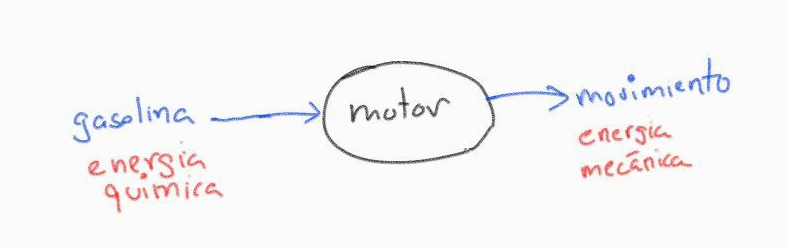
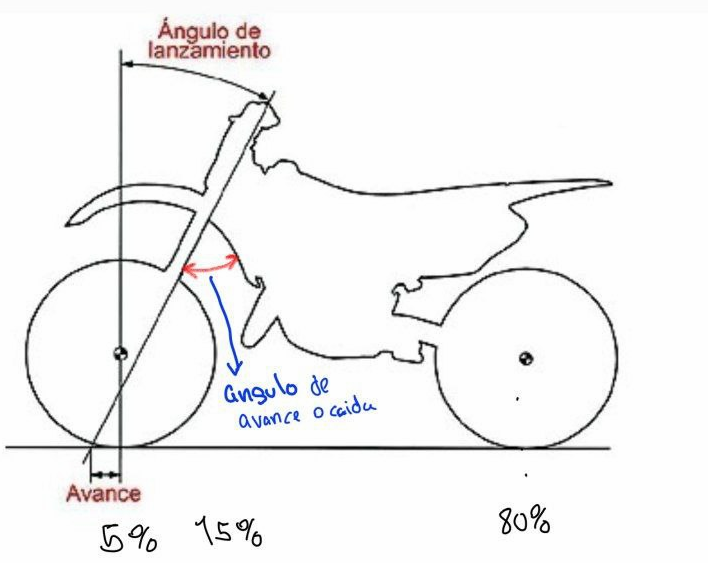

# MODULO I - MOTORES

## Tipo de mantenimiento

- Correctivo
- preventivo
- modificativo (Mejoras en el sistema)

## Conceptos

- **Vehiculo:** Transportar pasajeros y/o carga
- **Automotor:** Se mueve en virtud de sus propios mecanismos (vehiculos de tracción)
- **Automovil:** Tiene varios sistemas (elemmentos que generan movimiento)

### Sistema de Transmisión

Transmite movimiento a las ruedas

Velocidad maxima de marcha

Piñon, corona

### Dirección

### Frenos

Detiene la rueda a base de fricción seca, motivo por el cual calienta, existen los siguiente tipos de freno

- Tambor o balata
- Disco

Cuando el freno calienta pierde su adherencia o se cristaliza (fenomeno funny), principalmente sucede en los frenos de tambor ya que esta cerrado, en cambio el freno de disco esta mas ventilado

El sistema hidraulico puede tambien llegar a calentar incluso llegar a evaporarse por el calor, razón por la cual el freno se entra, por esta razón existen diferente liquidos de freno que aguantan diferentes temperaturas como

- Dot3 aguanta 100 grados
- Dot4
- Dot5

Cuando el liquido de freno comienza a degradarse, comienza a tener agua, la cual hierve mas rapido, por eso no coviene mezclar liquido de frenos

Existe un aparato que permite ver la cantidad de agua en el sistema hidraulico de frenos que cuesta en 80 o 90 Bs.

### Suspensión

Su función es absorver las irregularidades del terreno
