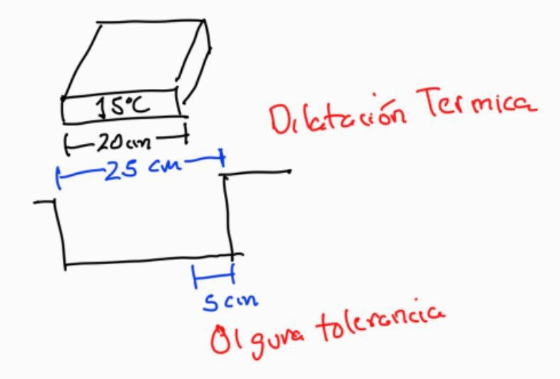
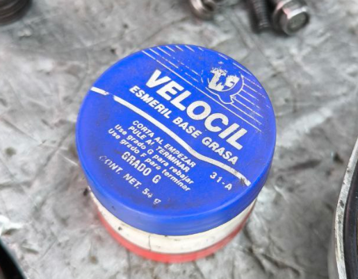
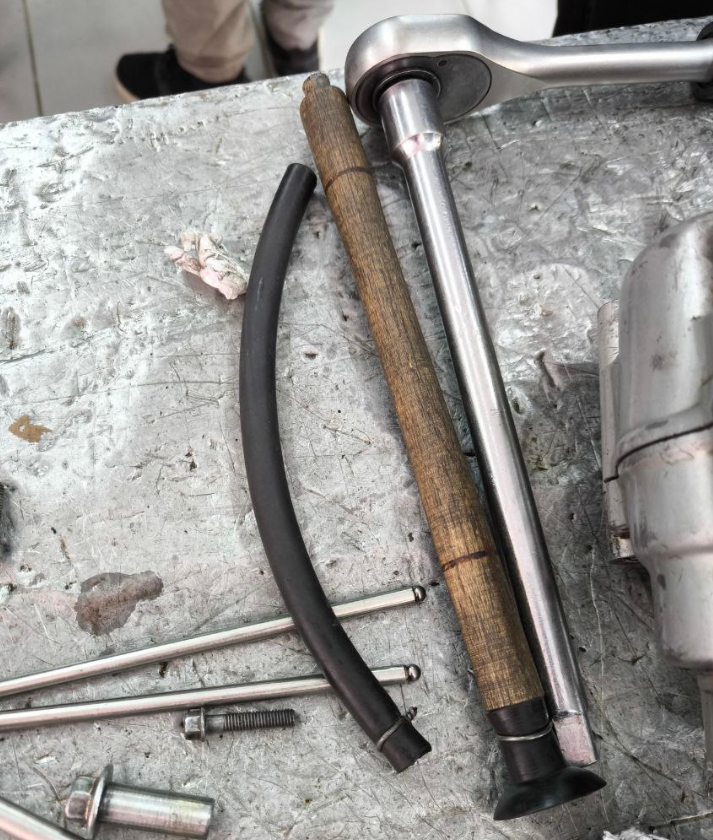
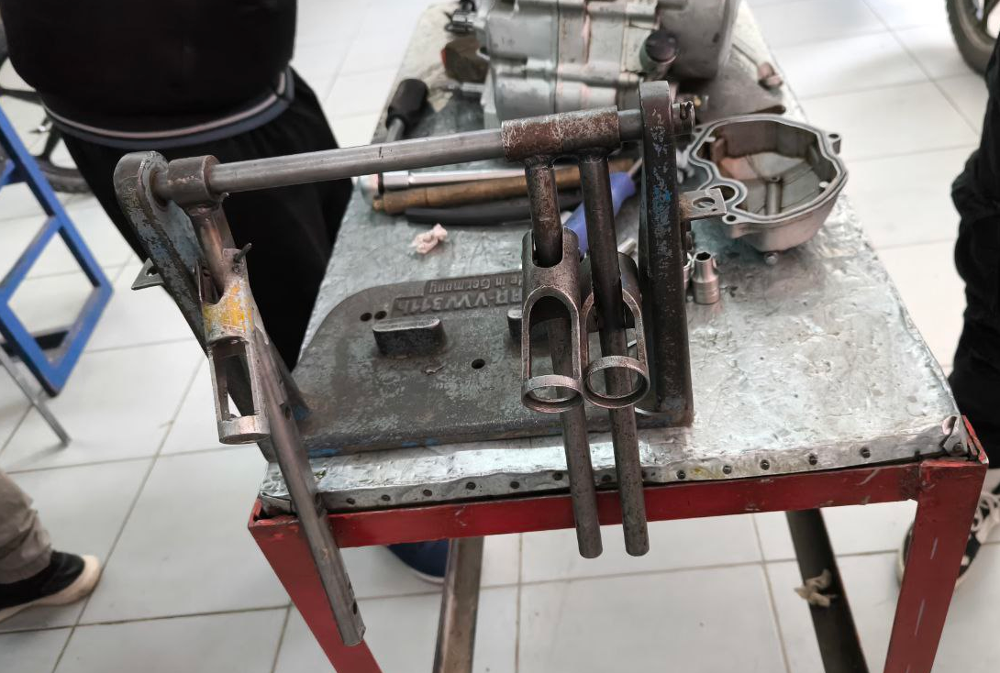
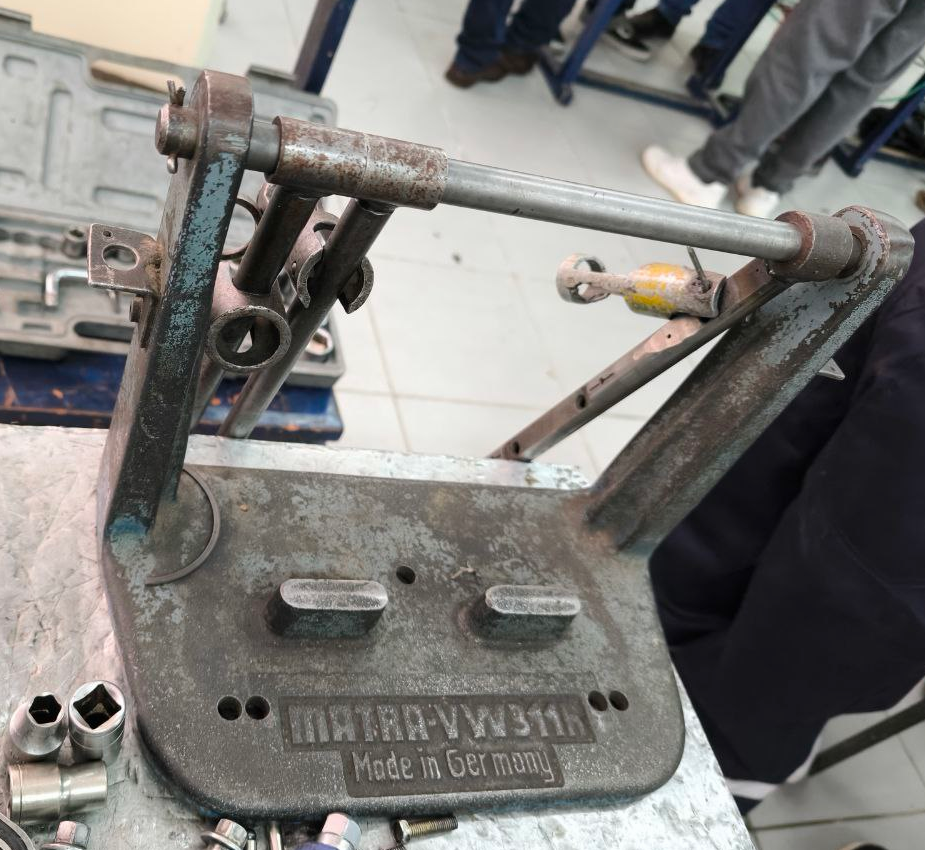
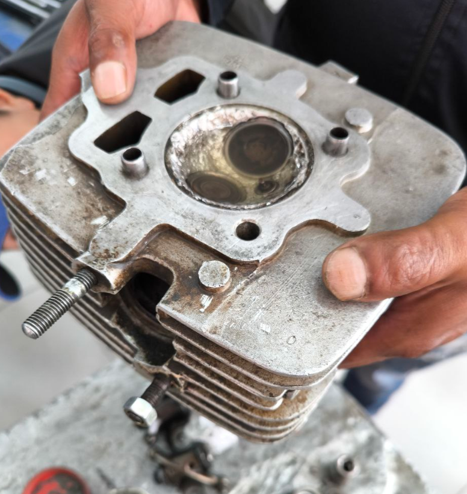

# FUNDAMENTOS

## Tipo de mantenimiento

- Correctivo
- preventivo
- modificativo (Mejoras en el sistema)

## Conceptos

- **Vehiculo:** Transportar pasajeros y/o carga
- **Automotor:** Se mueve en virtud de sus propios mecanismos (vehiculos de tracción)
- **Automovil:** Tiene varios sistemas (elemmentos que generan movimiento)

### Sistema de Transmisión

Transmite movimiento a las ruedas

Velocidad maxima de marcha

Piñon, corona

### Dirección

### Frenos

Detiene la rueda a base de fricción seca, motivo por el cual calienta, existen los siguiente tipos de freno

- Tambor o balata
- Disco

Cuando el freno calienta pierde su adherencia o se cristaliza (fenomeno funny), principalmente sucede en los frenos de tambor ya que esta cerrado, en cambio el freno de disco esta mas ventilado

El sistema hidraulico puede tambien llegar a calentar incluso llegar a evaporarse por el calor, razón por la cual el freno se entra, por esta razón existen diferente liquidos de freno que aguantan diferentes temperaturas como

- Dot3 aguanta 100 grados
- Dot4
- Dot5

Cuando el liquido de freno comienza a degradarse, comienza a tener agua, la cual hierve mas rapido, por eso no coviene mezclar liquido de frenos

Existe un aparato que permite ver la cantidad de agua en el sistema hidraulico de frenos que cuesta en 80 o 90 Bs.

### Suspensión

Su función es absorver las irregularidades del terreno

El amortiguador de imapacto tiene valvulas hidraulicas que puden llegar a calentar(por confirmar)

### Chasis

# MODULO I - MOTORES

### Trabajo

w = F\*d

Para realizar un trabajo se necesita energia

Existe distintos tipo de energia, a continuación se mencionan algunos:

- Sinetica
- Potencial
- Mecánica
- Quimica

### Motor

Sistema que transforma energia en movimiento

### Motor de combustion externa (MCE)

- Oxigeno
- Combustible
- Combustión

Sincronizado del motor (verificar compresión)

### Triangulo de fuego

Oxigeno - Chispa - Combustible

### Motor de combustion interna

### Ciclo de cuatro tiempos

Para que el motor funcione por si solo es necesrio que el piston haga cuatro recorridos

- Dos de arriba a abajo
- Dos de abajo a arriba

**Primer tiempo (Admisión).-** El pistón esta en el punto muerto superior y empieza a descender, en ese instante se abre la valvula de admisión y la mezcla de aire y gasolina son aspirados por el piston descendiente y van llenando el cilindro, cuando el embolo llega al punto inferiro se cierra la valvula de admisión y el cigueñal ha dado media vuelta

**Segundo tiempo (Compresión).-** El pisto sube desde el punto muerto inferior al superior y las dos valvulas estan cerradas, los gases que ocupan en cilindro van ocupando un espacio cada vez mas reducido, comprimiendose hasta llenar solamente el que queda entre la cara superior del pistón en su punto muerto superior y el fondo del cilindro, este espacio se llama camara de compresión o de explosión. Durante la compresión el piston ha subido del p.m.i al p.m.s y el ciguañal ha dado otra media vuelta.

**Tercer tiempo (Explosión).-** En el momento en que los gases estan fuertemente comprimidos en la camara de compresión salta la en la bujia la chispa, la fuerza de la explosión lanza el piston del p.m.s al p.m.i. Durante la carrera del embolo en la explosión las dos valvulas han permanecido cerradas y el ciguañal efectua una tercera media vuelta.

**Cuarto tiempo (Escape).-** El pisto esta en su p.m.i; la valvula de escape se abre y el pisto al momento de subir a su p.m.s empuja todos los gases quemados, expulsandolos por la tuberia de escape. Cuando el embolo alcanza el p.m.s la valvula de escape se cierra y el cigueñal gira otra media vuelta

***Para desarmar el motor, este debe esta con el piston en el punto muerto superior y ambas valvulas deben estar cerradas***

### Carburador

Prepara la mezcla de aire con gasolina pulverizada, de tal forma que su inflamación por una chispa resulte en una combustión rapida que perezca de casi instantanemente. La potencia explosiva de esta es la que se aprovecha en los cilindros para empujar con fuerza los pistones.

La mezcla se llama _aire carburado_, la proporción normal es de 10000 litros de aire por cada litro de gasolina, pero el caburador debe poder variar la dosificación con tal de obtener mezclas ricas

**Efecto Venturi**

- ¿Que es el surtidor de alta?
- ¿Que es el surtidor de baja?

### Sistema de distribución de valvulas

El cigueñal es el único que se mueve llevando el movimiento hacia el eje de levas 2 vueltas de cigueñal por 1 vuelta del eje de levas

- **Motor varillero (OHV).-** Eje de levas en la parte inferior al lado del cigueñal **ventaja** durabilidad mantenimiento, **desventaja** velocidad de accionamiento
- **Motor cadenero (OHC).-** Eje de levas en la parte superior de la culata **ventaja** velocidad de accionamiento, **desventaja** mantenimiento de cadenillas
- **Motor DOHC.-** Doble eje de levas en la parte superior

El ciguañal hace girar por un engranaje el arbol de levas y los salientes de estas por medio de los taques y valancines obligan a abrirse las valvulas, cuyos resortes tienden a mantenerlas cerradas

### Eje de levas

La temperatura adecuada del motor puede oscilar entre 80, 85, 90 y 95 grados a la que trabaja, no puede exceder esa temperatura

### Regulación de valvulas

#### Holguras

- Admisión 0.05mm - 0.08mm
- Escape 0.08mm - 0.10 mm

Dentro la valvula no tiene que entrar polvo o particulas

**Crema/Pasta para acentar valvulas (Crema esmeril)** Poner la crema en la cara de la valvula

Sujetador de valvulas (no se si es correcto el nombre)

**Prueba de estanqueidad** con gasolina, la gasolina tiene que estancarse por lo menos 30 segundos, si sale por los colectores hay que seguir acentuando

**Mantenimientos correctivos** 

Si la culata esta doblada, va haber fugas de compresión, llevar al tornero para que la limpie

